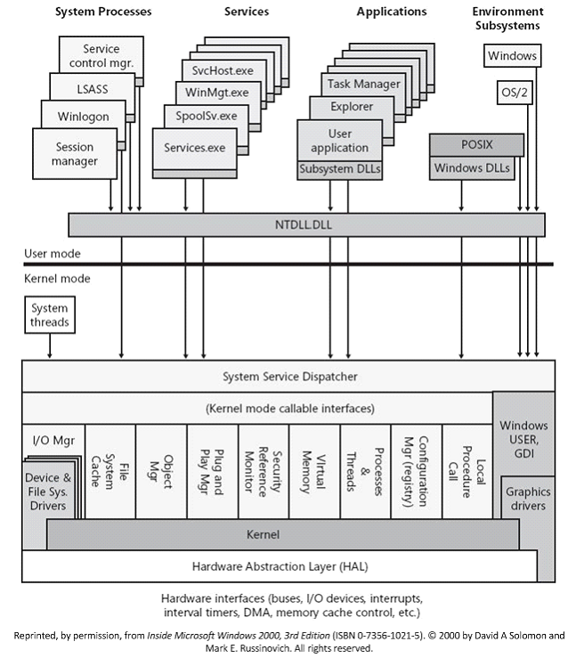
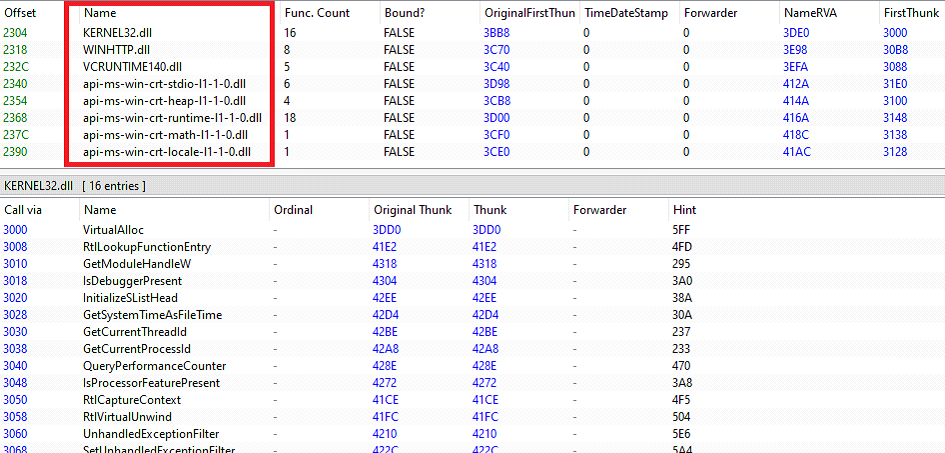
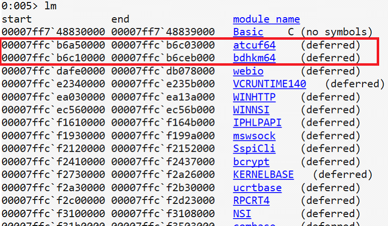
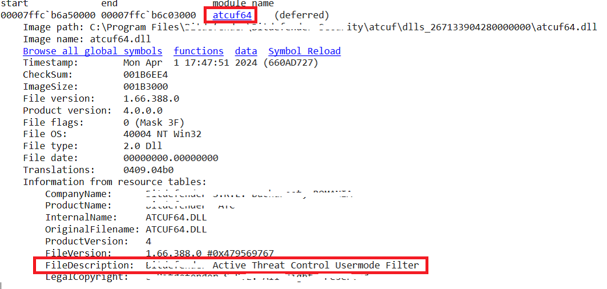
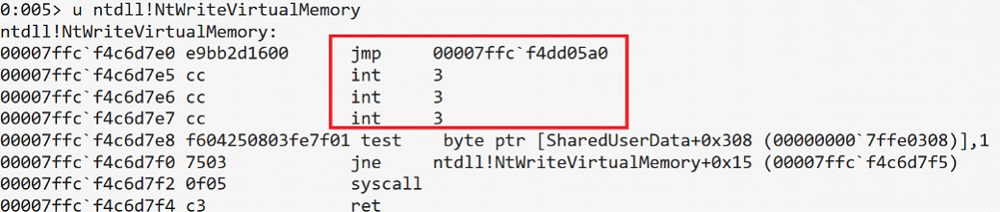
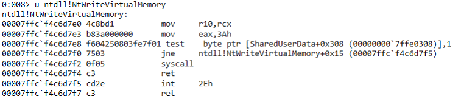
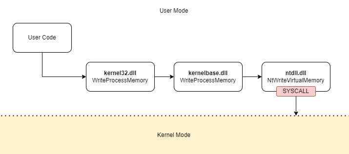
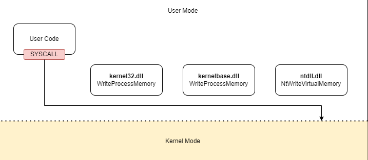
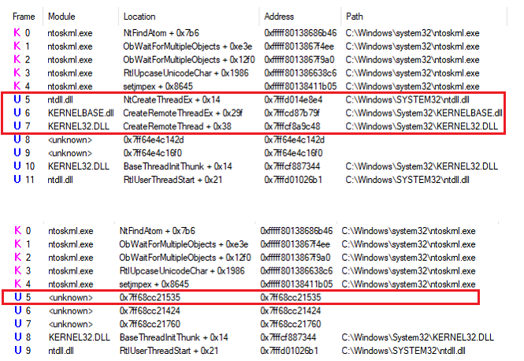

# Direct Syscall

## Stuff you should know

Although many vendors are adopting more modern and robust techniques, inline hooking (or function hooking) is still a widely used technique, mainly because of its ability to provide detailed monitoring of operations at the process level.

Until 2005, before the introduction of Kernel Patch Protection (KPP, better known as PatchGuard) with the 64-bit edition of Windows XP, function hooking was performed by overwriting the System Service Dispatch Table (SSDT), a data structure in the kernel that contains pointers to system functions. The pointers in the SSDT could be overwritten to redirect the flow of system calls to custom listening functions.

However, this technique had major security implications, as any software with sufficient privileges could modify the SSDT, putting the entire system at risk. The introduction of PatchGuard, a system designed to prevent unauthorised changes to the Windows kernel by periodically checking the integrity of its internal structures, eliminated the possibility of using SSDT overwriting for legitimate purposes. This forced vendors to adopt more secure and robust function-hooking techniques.

Currently, function hooking is performed in user mode, focusing mainly on the functions in the `ntdll.dll` library, as this is the library closest to the kernel level (see figure below). This library contains the low-level functions that implement the code required to make syscalls.
In addition to `ntdll.dll`, function hooking may also affect other libraries, such as `kernel32.dll`, `user32.dll`, `advapi32.dll`, etc., either for redundancy or to monitor events other than system calls.

  

Function hooking basically consists of an unconditional jump instruction (`jmp`) that redirects the execution flow to a DLL injected at runtime by the EDR. This DLL implements monitoring functions to analyse the intercepted function calls.

As an example, consider the following case. Figure below shows the table of modules and functions it imports, as extracted from its Import Directory Table (IDT) and Import Lookup Table (ILT).

  

The next figures shows the modules loaded after execution. You can see that, in addition to the various system modules, two libraries associated with the EDR installed on the system are also injected into the process memory.

  
  

The next two figures show a comparison between the version with and without the 'NtWriteVirtualMemory' hook of ntdll.dll. Comparing the two images you can immediately see how it has been modified by the EDR to perform an unconditional jump to a specific memory address.

  
  

## Direct Syscall

The use of Direct Syscall is a technique that's been around in software engineering for a while now. This approach lets programmers avoid high-level application programming interfaces by interacting directly with the operating system kernel, which makes specific critical operations more efficient.

In recent years, though, Direct Syscall have also become really important in the security field. This is because they've been widely adopted by malware to get around the inline hooking that's been put in place by EDRs.

The way a direct system call is implemented is pretty straightforward. Rather than using the Windows API, which calls system functions via `ntdll.dll`, the call stub is added directly to the user application code.

Flowcharts are a great way to get your head around how a direct system call works. They show the difference between a standard system call and a direct system call.

The next figure shows the flowchart for a standard system call, like a request to write to the memory area of a specific process. This is handled by the Windows API called `WriteProcessMemory`, which you'll find in `kernel32.dll`. This API first calls the function `WriteProcessMemory` in `kernelbase.dll`, which then calls `NtWriteVirtualMemory` in `ntdll.dll`. This last function is what actually executes the syscall to switch from user mode to kernel mode, where the write to memory is done.

  

This other figure shows how the standard flow is affected when Direct Syscall is used. In this case, the syscall instruction and its preparatory instructions are added straight into the user application code. It completely bypasses the Windows API and any hooks inserted by EDRs for monitoring system calls.

  

The idea behind a Direct Syscall is pretty straightforward, but there are a few technical challenges to overcome before it can be made to work:

- The first thing we need to do is figure out which stub assembly is responsible for executing the syscall in `ntdll.dll`. This would actually require a bit of reverse engineering, where we'd have to analyse the library to identify the exact sequence of instructions needed to run the desired system call. These instructions are well documented these days, thanks to all the research that's been done, so we don't need to go over it again.
- Another thing we need to figure out is how to resolve the System Service Number (SSN) for the desired syscall on the fly. The SSN is a unique identifier that the kernel uses to determine which operating system function to execute. It's stored in the SSDT. But this number can vary not only between different versions of Windows, but also between different builds of the same version. This means that the code can't just use the SSN in one fixed way. It has to be able to find it when it's needed. In this project, we achieve this by using [SysWhispers3](https://github.com/klezVirus/SysWhispers3).

## Implementation
*For didactic reasons, the implementation in this project has been kept as simple as possible to make the technique easy to understand.*

What happens is that exactly what `ntdll.dll` does is reimplemented. In fact, `Syscalls.h` exposes exactly the same signature as the original `ntdll.dll` API (taken from the great [phnt](https://github.com/winsiderss/phnt) project), and its implementation is copied exactly as it is in `Syscalls.asm`. The code, which follows the Microsoft Macro Assembler (MASM) syntax, include following instructions:
- A first instruction `mov r10, rcx`, which copies the value contained in the `rcx` register, which corresponds to the first parameter of the function according to the Windows x64 calling convention, to the `r10` register. This is done to preserve the original value of the `rcx` register, since this register is used internally by the syscall to perform other operations;
- A second instruction `mov eax, <SSN>` which loads the value of the SSN into the `eax` register. **For the sake of simplicity, in this example the value of the SSN has not been dynamically resolved, but extracted from ntdll.dll and statically copied into the code**;
- The `syscall` instruction, which causes the switch from user mode to kernel mode and instructs the processor to execute the function corresponding to the SSN value in the `eax` register;
- The `ret` instruction, which returns to the caller.

## Focus on Call Stack
In this section we will analyse what the call stack looks like after applying the various syscall techniques we will see. In particular, we will focus on the call stack of the 'CreateRemoteThread' event, from the point of view of the injected process.

In this first analysis, we will compare the call stack generated by the 'WinAPI' executable (the one that used the `kernel32.dll` API) and the one generated by using Direct Syscall, as shown in the following figure:

  

As expected, in the second call stack, all references to system libraries have disappeared, and the function immediately preceding the kernel functions is a function that belongs to the `.text` section of the user application and is therefore shown as unknown.

## Test Result
The shellcode runs successfully at first, but soon after, the PE gets blocked and flagged as malicious. This could be because the inline hooks were bypassed, allowing the "malicious" code to run. However, using direct system calls leaves behind a bunch of traces that the EDR can pick up on, which makes it easier for it to mark the executable as malicious.

## RELATED PROJECTS

[SysWhispers2](https://github.com/jthuraisamy/SysWhispers2) by @jthuraisamy\
[SysWhispers3](https://github.com/klezVirus/SysWhispers3) by @klezVirus

## REFERENCES

[https://redops.at/en/blog/direct-syscalls-a-journey-from-high-to-low](https://redops.at/en/blog/direct-syscalls-a-journey-from-high-to-low)\
[https://www.ired.team/offensive-security/defense-evasion/using-syscalls-directly-from-visual-studio-to-bypass-avs-edrs](https://www.ired.team/offensive-security/defense-evasion/using-syscalls-directly-from-visual-studio-to-bypass-avs-edrs)\
[https://www.paloaltonetworks.com/blog/security-operations/a-deep-dive-into-malicious-direct-syscall-detection/](https://www.paloaltonetworks.com/blog/security-operations/a-deep-dive-into-malicious-direct-syscall-detection/)\
[https://www.crow.rip/crows-nest/mal/dev/inject/syscalls/direct-syscalls](https://www.crow.rip/crows-nest/mal/dev/inject/syscalls/direct-syscalls)\
[https://unprotect.it/technique/evasion-using-direct-syscalls/](https://unprotect.it/technique/evasion-using-direct-syscalls/)
