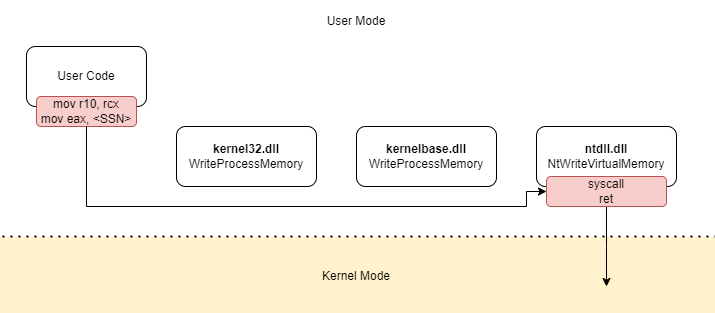

# Indirect Syscall

Indirect syscalls are an improvement on direct syscalls, designed to reduce the IOCs generated by the latter. In fact, the switch from user mode to kernel mode caused by a `syscall` instruction in a memory area belonging to the user process could be a clear warning of EDRs. Also, Direct Syscall suffers of *"the mark of the syscall"*, as @klezVirus clearly points out in his blog post:

> As SysWhispers mainly includes the assembly instructions for the syscalls’ stubs, it was apparent to me that the detection should be based on something related to the stubs. After a while, I realised it was actually the syscall instruction. Thinking about it, it made sense, because there is no valid reason a syscall should be executed directly by an executable. Naturally, when a program needs to execute a System Call, it does that by using an exposed API, so the syscall instruction should be present, by logic, only in ntdll.dll.

A syscall is normally expected to come from `ntdll.dll`. Indirect syscalls attempt to solve this problem by implementing a mechanism that allows system calls to continue to be executed directly by user code, but make it appear that they are coming from `ntdll.dll`. This approach masks the true origin of the call, making the operation appear more legitimate to security tools and thus reducing IOCs and visible anomalies in the call stack.

Implementing an indirect syscall consists of two basic steps:
- The first is to find a `syscall` instruction within the code of `ntdll.dll`;
- The second step is to modify the assembly stub by replacing the `syscall` instruction with an unconditional jump (`jmp`) to the address of the previously found syscall instruction

In this way, the execution of the system call is split into two parts: the register preparation takes place in the user code, while the actual `syscall` is executed by `ntdll.dll`. 

  

At this point, two different scenarios could be implemented:
- In the first case, the selected `syscall` instruction belongs to the intended `ntdll.dll` function. This approach maintains a consistent call stack between user and kernel operations, reducing the risk of detection when the EDR relies on call stack consistency;
- In a second scenario, the selected `syscall` belongs to a function generally identified by EDRs as 'bening', thus modifying the call stack but better hiding the true intentions.

## Implementation
*For didactic reasons, the implementation in this project has been kept as simple as possible to make the technique easy to understand.*

Switching from a direct to an indirect syscall is pretty straightforward. 

Essentially, in the assembler code, the `syscall` and `ret` instructions are replaced with the `jmp QWORD PTR <variable>` instruction, which makes an unconditional jump to the memory address passed as an argument. In this case, that address will point to the syscall instruction within the context of ntdll.dll.

## Focus on Call Stack
This time, the function immediately preceding the transition to kernel space is correctly identified as the `NtCreateThreadEx` function in `ntdll.dll`. This occurs because the `syscall` instruction is now executed within the memory context of `ntdll.dll`, rather than in user code, as was the case with direct syscalls

## Test Result
The shellcode ran successfully, and the antivirus software didn’t generate any notifications.

## RELATED PROJECTS

[SysWhispers3](https://github.com/klezVirus/SysWhispers3) by @klezVirus

## REFERENCES

[https://klezvirus.github.io/RedTeaming/AV_Evasion/NoSysWhisper/](https://klezvirus.github.io/RedTeaming/AV_Evasion/NoSysWhisper/)\
[https://redops.at/en/blog/direct-syscalls-vs-indirect-syscalls](https://redops.at/en/blog/direct-syscalls-vs-indirect-syscalls)\
[https://www.crow.rip/crows-nest/mal/dev/inject/syscalls/indirect-syscalls](https://www.crow.rip/crows-nest/mal/dev/inject/syscalls/indirect-syscalls)
